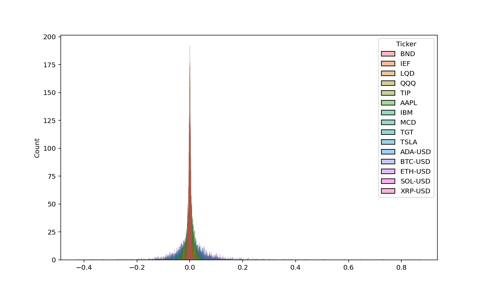

## Efficient Diversification ##
Efficient Diversification is a core principle in Modern Portfolio Theory. You do not want to put all of your eggs in one basket. This is not Time Series, all of the data is historical. The main idea is you want to optimize the weights of your portfolio. Usually, most investors do this with a very safe asset (a Debt-Instrument that is very unlikely to default) However, in this example, there are three Asset Classes: ETF’s, Stocks, and Crypto. So, there are three weights regardless.

# Requirements
```bash
pip install yfinance matplotlib seaborn numpy pandas pyportfolioopt
```


Make a list of the assets you want to download from yfinance or another api for financial data. Stock Assets go with stock assets, ETF Assets go with ETF assets and Crpyto goes with Crypto
```python
stock_tickers = ['AAPL', 'TGT', 'MCD', 'IBM', 'TSLA']
ETF_tickers = ['BND', 'QQQ', 'TIP', 'IEF', 'LQD']
CRYPTO_tickers = ['BTC-USD', 'ETH-USD', 'SOL-USD', 'ADA-USD', 'XRP-USD']
```

Choose a start date and end date to download the data
```python
start_date = "2020-10-10"
end_date =  "2025-05-12"
```
Make sure if you are using yfinance to put the assets in different classes for each asset class if you plan on doing other tasks with the download. I combine all of the separate asset data frames through pandas
```python
df_stocks = yf.download(stock_tickers,start_date,end_date,period="max")['Close']
df_etf = yf.download(ETF_tickers,start_date,end_date,period="max")['Close']
crypto_df = yf.download(CRYPTO_tickers,start_date,end_date,period="max")['Close']
```
This is the portfolio dataframe that is for Efficient Diversification
```python
df_combined = pd.concat([df_etf,df_stocks,crypto_df],axis=1)
```
The returns and corr_matrix are not necessary, however, they are helpful in explaining the concept of MPT. Get rid of null values and NAN's when printing, logging etc. the returns of the historical data
```python
returns = df_combined.pct_change().dropna()
corr_matrix = df_combined.corr()
print(f'Returns: {returns}')
```
This is a quick example of the CLT when using MPT with multiple asset classes



# Correlation of Assets
This is very important. You need to see the correlation of assets. You do not want assets to move in the same direction. For example, if a equity asset is negative and a ETF asset is positive, this is good. If you are both positive or both negative, there is close to no diversification. If the correlation is equal to exactly 0, then the securities have no correlation at all.


Say you want to allocate 50% to McDonalds and 50% to QQQ
# Equations for MPT


# The Sharpe Ratio
- You want to maximize the Sharpe ratio, which is the Risk-Premium divided by the risk of the overall portfolio.
-The Risk-Free Rate is the default risk of a T-Bill(the Safe Asset)


